# Bridge Maintenance Agentic Clustering v1.0 🤖

## Overview

This project applies **self-improving (Agentic) clustering with Bayesian Optimization** to bridge maintenance data in Yamaguchi Prefecture, Japan, to automatically identify bridge groups with high maintenance priority.

Bayesian Optimization is applied to all clustering methods for efficient and highly accurate parameter exploration. A composite evaluation metric (Silhouette + Davies-Bouldin + Balance) automatically generates well-balanced clusters.

### 🆕 Key Improvements in v1.0 (Bayesian Optimization Edition)

1. **Bayesian Optimization Fully Integrated**
   - GMM: n_components (10-76) × covariance_type (4 types)
   - DBSCAN: eps (0.5-2.0) × min_samples (5-50)
   - HDBSCAN: min_cluster_size (10-100) × min_samples (3-25)
   - CLASSIX: radius (0.3-0.5) × minPts (3-40)
   - 100 evaluations per method for efficient optimal parameter search

2. **Composite Evaluation Metric Introduced**
   - **Silhouette Score**: 35% (cluster separation)
   - **Davies-Bouldin Index**: 35% (cluster compactness)
   - **Cluster Balance Score**: 30% (cluster size uniformity)
   - Normalized to 0-1 range for fair evaluation

3. **Constraint Optimization**
   - Cluster count: 10-76 (0.5-4× of 19 municipalities)
   - DBSCAN threshold: 76 (4× of 19 municipalities)
   - HDBSCAN: Excluded if noise ratio > 10%
   - Gradual penalty for flexible control

4. **Progress Display Improvements**
   - Display current best score every 10 iterations
   - Visualize convergence status
   - Clearly show optimal parameters and scores

---

## 📊 v1.0 Execution Results

### Final Selected Method
- **DBSCAN** selected with total score of 43.79
- Cluster count: 34 (approximately 1.8× of 19 municipalities)
- Noise ratio: 9.9% (425 points)
- Optimal parameters: eps=1.802, min_samples=5

### Comparison of All Methods

| Rank | Method | Total Score | Silhouette | DB Index | Clusters | Noise Rate | Status |
|------|--------|-------------|-----------|----------|----------|------------|--------|
| 🥇 1st | **DBSCAN** | **43.79** | 0.077 | 1.306 | 34 | 9.9% | ✅ **Selected** |
| 🥈 2nd | KMeans | 43.22 | 0.147 | 1.634 | 19 | 0% | Candidate |
| 🥉 3rd | GMM | 42.58 | 0.109 | 1.653 | 34 | 0% | Candidate |
| 4th | CLASSIX | 41.65 | 0.023 | 1.420 | 52 | 0% | Candidate |
| - | HDBSCAN | 46.66 | 0.199 | 1.458 | 57 | 24.9% | ❌ Excluded |

### Bayesian Optimization Convergence

#### GMM
- Converged at 40 evaluations (score 0.3885)
- Optimal: n_components=34, covariance_type=spherical
- Search space: 10-76 × 4 types = 264 combinations
- **Efficiency**: Approximately 6.6× faster than random search

#### DBSCAN
- Converged at 30 evaluations (score 0.2135)
- Optimal: eps=1.802, min_samples=5
- Search space: continuous × integer (theoretically infinite)
- **First adoption**: Added to candidates after threshold change

#### HDBSCAN
- Converged at 30 evaluations (score 0.1882)
- Optimal: min_cluster_size=26, min_samples=3
- Excluded due to 24.9% noise (exceeds 10% threshold)

#### CLASSIX
- Converged at 80 evaluations (score 0.1925)
- Optimal: radius=0.421, minPts=3
- Cluster imbalance issue persists (max cluster 1108 points)

### Dimensionality Reduction
- **UMAP** selected (overlap score 0.24)
- t-SNE: 4.37 (18× more overlap than UMAP)
- Cluster visualization greatly improved

---

## 🔄 System Workflow

```mermaid
flowchart TD
    A["📊 Data Preprocessing<br/>4,292 bridges × 13 features"] --> B["🔵 KMeans<br/>Silhouette Optimization"]
    B --> C{"📈 Quality Check<br/>Total Score < 60?"}
    
    C -->|Yes| D["🟣 GMM<br/>Bayesian Optimization 100 evals"]
    C -->|No| L["🎯 Select Optimal Method"]
    
    D --> E["🟢 DBSCAN<br/>Bayesian Optimization 100 evals"]
    E --> F["🟡 HDBSCAN<br/>Bayesian Optimization 100 evals"]
    F --> G["🟠 CLASSIX<br/>Bayesian Optimization 100 evals"]
    
    G --> H{"🚫 Exclusion Check"}
    H -->|"DBSCAN > 76"| I["❌ Exclude DBSCAN"]
    H -->|"HDBSCAN noise > 10%"| J["❌ Exclude HDBSCAN"]
    H -->|"Meets criteria"| K["✅ Add to Candidates"]
    
    I --> L
    J --> L
    K --> L
    
    L --> M["🎨 Dimensionality Reduction<br/>t-SNE / UMAP"]
    M --> N["📊 Visualization<br/>6 types of graphs"]
    
    style B fill:#e3f2fd
    style D fill:#f3e5f5
    style E fill:#e8f5e9
    style F fill:#fff9c4
    style G fill:#ffe0b2
    style L fill:#ffecb3
    style N fill:#c8e6c9
```



---

## 🎓 Lessons Learned in v1.0

### 1. Effectiveness of Bayesian Optimization

**Advantages**:
- Significant speedup compared to grid search (6-10×)
- Efficient exploration of continuous parameter spaces
- Computational resource savings through early convergence

**Challenges**:
- Significant impact of initial random exploration (10 evaluations)
- Risk of convergence to local optima
- Requires prior knowledge of parameter ranges

### 2. Effect of Composite Evaluation Metrics

**Successes**:
- Multi-faceted evaluation of cluster quality beyond Silhouette alone
- DB Index considers compactness
- Balance Score suppresses cluster size bias

**Room for Improvement**:
- Could not fully resolve CLASSIX cluster imbalance
- Max cluster still occupies 25% of total even with 30% Balance Score
- Further weight adjustment needed (consider 35% → 40%)

### 3. Importance of Constraints

**Successful Constraints**:
- DBSCAN threshold 76: Converges to appropriate cluster count range
- HDBSCAN noise 10%: Prevents excessive noise removal
- Cluster count 10-76: Limited to manageable range

**Improvement Suggestions**:
- Further narrow CLASSIX radius range (0.3-0.4)
- Add minimum constraint to Balance Score (e.g., ≥0.05)
- Max cluster size constraint (e.g., ≤20% of total)

### 4. Method Selection Criteria

**Reasons for DBSCAN Selection**:
- Slight advantage in total score (0.57 point difference)
- 34 clusters appropriate for management (1.8× of municipalities)
- 9.9% noise within acceptable range
- Density-based approach reflects geographic characteristics

**Alternative Considerations**:
- KMeans (19 clusters): Simple and interpretable
- GMM (34 clusters): Flexible with probabilistic assignment
- Feature to present options based on use case would be effective

---

## 🛠️ Technical Implementation Details

### Bayesian Optimization Implementation

```python
from skopt import gp_minimize
from skopt.space import Real, Integer
from skopt.utils import use_named_args

# Define search space (DBSCAN example)
space = [
    Real(0.5, 2.0, name='eps'),
    Integer(5, 50, name='min_samples')
]

# Objective function
@use_named_args(space)
def objective(eps, min_samples):
    # Execute clustering
    dbscan = DBSCAN(eps=eps, min_samples=min_samples)
    labels = dbscan.fit_predict(X_scaled)
    
    # Calculate composite score
    silhouette = silhouette_score(X[mask], labels[mask])
    db_index = davies_bouldin_score(X[mask], labels[mask])
    db_normalized = max(0, 1.0 - db_index / 3.0)
    
    # Balance Score
    counts = np.unique(labels[mask], return_counts=True)[1]
    balance_score = max(0, 1.0 - counts.std() / (counts.mean() + 1e-6))
    
    # Composite score
    combined_score = 0.35 * silhouette + 0.35 * db_normalized + 0.3 * balance_score
    
    # Constraint penalties
    if n_clusters < 10:
        combined_score *= 0.1
    elif n_clusters > 76:
        combined_score *= 0.1
    
    return -combined_score  # Negative for minimization

# Execute optimization
result = gp_minimize(
    objective,
    space,
    n_calls=100,
    n_initial_points=10,
    random_state=42
)
```

### Composite Score Calculation

```python
# Silhouette Score: 0-1 (higher is better)
silhouette = silhouette_score(X[mask], labels[mask])

# Davies-Bouldin Index: 0+ (lower is better) → normalized
db_index = davies_bouldin_score(X[mask], labels[mask])
db_normalized = max(0, 1.0 - db_index / 3.0)

# Balance Score: based on standard deviation (higher is more uniform)
counts = np.unique(labels[mask], return_counts=True)[1]
balance_score = max(0, 1.0 - counts.std() / (counts.mean() + 1e-6))

# Composite score (v1.0: 35:35:30)
combined_score = 0.35 * silhouette + 0.35 * db_normalized + 0.3 * balance_score
```

### Constraint Penalties

```python
# Cluster count constraints (10-76)
if n_clusters < 10:
    combined_score *= 0.1  # 90% penalty
elif n_clusters < 15:
    combined_score *= 0.6  # 40% penalty
elif n_clusters > 76:
    combined_score *= 0.1  # 90% penalty
elif n_clusters > 60:
    combined_score *= 0.7  # 30% penalty

# Noise ratio penalty (DBSCAN/HDBSCAN)
if noise_ratio < 0.10:
    combined_score *= (1.0 - noise_ratio * 0.5)
elif noise_ratio < 0.35:
    combined_score *= max(0.1, 1.0 - noise_ratio * 1.5)
else:
    combined_score *= 0.05  # 95% penalty
```

---

## 📈 Performance Comparison

### Execution Time (4,292 bridge dataset)

| Method | Search Method | Evaluations | Runtime | Notes |
|--------|---------------|-------------|---------|-------|
| KMeans | Silhouette Score | 18 times | ~30 sec | Sequential evaluation for k=2-19 |
| GMM | Bayesian Optimization | 100 times | ~3 min | Converged at 40 |
| DBSCAN | Bayesian Optimization | 100 times | ~4 min | Converged at 30 |
| HDBSCAN | Bayesian Optimization | 100 times | ~5 min | Converged at 30 |
| CLASSIX | Bayesian Optimization | 100 times | ~6 min | Converged at 80 |

**Total Runtime**: Approximately 20 minutes (including preprocessing and visualization)

### 🚀 Parallel Processing Optimization (v1.0)

To accelerate Bayesian optimization, we switched from `gp_minimize` (Gaussian Process) to `forest_minimize` (Random Forest):

**Key Configuration**:
- `N_BAYESIAN_CALLS = 100`: Total evaluations
- `N_INITIAL_POINTS = 20`: Initial random exploration (**fully parallelized**)
- `N_JOBS = -1`: Use all available CPU cores

**Performance Improvement**:
- **Initial Random Exploration (20 evals)**: Fully parallelized → **Up to 20× speedup** with multi-core CPUs
- **Sequential Exploration (80 evals)**: Random Forest prediction is partially parallelized
- **Overall**: ~40% faster compared to previous settings (10 initial + 90 sequential)

**Lessons Learned**:
1. `forest_minimize` is better suited for parallelization than `gp_minimize` (Random Forest trees are independently trainable)
2. Increasing `n_initial_points` maximizes parallel processing effectiveness
3. Clustering algorithm evaluation itself (GMM, DBSCAN, etc.) cannot be parallelized, so the speedup is mainly in parameter exploration
4. Reducing total evaluations (e.g., 100 → 50) can halve runtime, though it may slightly reduce accuracy

### Comparison with Grid Search (Estimated)

| Method | Grid Search Combinations | Bayesian Evaluations | Reduction |
|--------|-------------------------|---------------------|-----------|
| GMM | 264 combinations | 100 evals | 62% reduction |
| DBSCAN | ~500 combinations | 100 evals | 80% reduction |
| HDBSCAN | ~450 combinations | 100 evals | 78% reduction |
| CLASSIX | ~456 combinations | 100 evals | 78% reduction |

---

## 🎯 Project Overview

### Objectives
- Cluster bridges in Yamaguchi Prefecture by maintenance difficulty
- Quantitatively extract groups with high repair priority
- Support rational repair planning combining fiscal strength index and demographics
- **v1.0**: Automatically search for optimal parameters using Bayesian Optimization

### Dataset
- **Bridge Data**: 4,292 bridges (Yamaguchi Prefecture)
- **Fiscal Data**: 19 municipalities
- **Population Statistics**: 19 municipalities
- **Geospatial Data**: Rivers and coastline

---

## Feature System (13 Features)

### Basic Features (6 items)

| Feature | Description | Data Source |
|---------|-------------|-------------|
| `bridge_age` | Years since construction | Bridge Data |
| `condition_score` | Health score (0-3) | Bridge Data |
| `maintenance_priority` | Maintenance priority | Bridge Data |
| `future_burden_ratio` | Future burden ratio (%) | Fiscal Data |
| `aging_rate` | Aging rate (%) | Population Data |
| `fiscal_index` | Fiscal strength index | Fiscal Data |

### Extended Features (5 items)

| Feature | Description | Calculation Method |
|---------|-------------|--------------------|
| `structure_category` | Structure type category (0-4) | RC/PC/Steel/Box/Other |
| `bridge_area` | Bridge area (m²) | Length × Width |
| `emergency_route` | Emergency route flag (0/1) | Extracted from route name |
| `overpass` | Railway overpass flag (0/1) | Extracted from bridge name |
| `repair_year_normalized` | Normalized latest repair year | MinMax scaling |

### Geospatial Features (2 items) ✨ NEW

| Feature | Description | Data Source | Calculation Method |
|---------|-------------|-------------|-------------------|
| `under_river` | Under river flag (0/1) | National Land Numerical Information (River Data) | 50m buffer detection in UTM projection |
| `distance_to_coast_km` | Distance to coastline (km) | National Land Numerical Information (Coastline Data) | Geodesic distance calculation |

#### Geospatial Feature Implementation Details

**Coordinate Reference System (CRS)**:
- Input: WGS84 (EPSG:4326)
- Calculation: UTM Zone 53N (EPSG:32653)
- Auto-assign EPSG:4326 when Shapefile lacks CRS information

**River Detection**:
```python
# 50m buffer in UTM projection
bridge_point_proj = bridge_point.to_crs("EPSG:32653")
river_buffer = river_data_proj.buffer(50)  # 50m
has_river = bridge_point_proj.within(river_buffer.unary_union)
```

**Coastline Distance**:
```python
# Geodesic distance (calculated in WGS84)
distances = coastline.geometry.apply(
    lambda geom: bridge_point.distance(geom)
)
distance_m = distances.min() * 111000  # degrees to meters
distance_km = distance_m / 1000
```

**Execution Results**:
- Bridges under river: 2,447 (57.0%)
- Coastline distance range: 0.00-30.09 km
- Coastline distance average: 9.19 km

---

## 🚀 Quick Start

### Installation

```bash
# Create virtual environment
python -m venv venv

# Activate (Windows)
venv\Scripts\activate

# Install packages
pip install -r requirements.txt
```

### Required Packages

```txt
numpy==1.25.2
pandas==2.1.1
scikit-learn==1.3.1
scikit-optimize==0.10.2  # v1.0 newly added
matplotlib==3.8.0
seaborn==0.13.0
umap-learn==0.5.4
hdbscan==0.8.40
classix==1.3.2
openpyxl==3.1.2
geopandas==0.14.0
shapely==2.0.2
```

### Execution

```bash
# Run all processes
python run_all.py

# Or run individually
python data_preprocessing.py  # Data preprocessing
python main.py               # Clustering
python visualization.py      # Visualization
```

---

## 📁 Output Files

Results are saved in the `output/` folder. Please check the following files:

### 📊 Visualization Files

#### 🤖 agentic_improvement_log.txt - Agentic Clustering Improvement Log
Detailed log of the Bayesian optimization process:
```
🟣 GMM (Gaussian Mixture Model) を実行中...
   🔬 ベイズ最適化でパラメータ探索を実行します（100回評価）
   🚀 Random Forestベースで全CPUコア並列処理を実行...
   📊 初期ランダム探索: 20回(並列)、逐次探索: 80回
   評価 10/100: 現在の最良スコア = 0.3745
   評価 40/100: 現在の最良スコア = 0.3816
   ✓ 最適パラメータ: n_components=34, covariance_type=spherical
   ✓ 調整後スコア: 0.3816
```

#### 📊 cluster_pca_scatter.png - 2D Scatter Plot (Optimal Dimensionality Reduction)

- UMAP-reduced 2D visualization of 4,292 bridges
- Color-coded by cluster labels (DBSCAN: 34 clusters)
- Shows clear cluster separation with minimal overlap

#### 🌐 cluster_pca_scatter_3d.png - 3D Scatter Plot (**NEW!**)

- UMAP-reduced 3D visualization for better spatial understanding
- Rotated view (elevation=20°, azimuth=45°) for optimal perspective
- Reveals hidden cluster structures not visible in 2D

#### 🔥 cluster_heatmap.png - Feature Heatmap

- 34 clusters × 13 features with standardized values
- Color intensity: blue (low) → white (medium) → red (high)
- Enlarged size (20×9 inches) with readable annotations
- Identifies characteristic features for each cluster

#### 🌳 cluster_hierarchy.png - Cluster Hierarchy Dendrogram (**NEW!**)

- Hierarchical clustering dendrogram using Ward linkage
- Shows relationships and merging distances between clusters
- Helps identify potential cluster groupings and outliers

#### 📡 cluster_radar.png - Radar Chart

- Multi-dimensional feature profiles for selected clusters
- Compares high-priority vs. low-priority bridge groups
- Visualizes feature balance across dimensions

#### 📊 cluster_distribution.png - Cluster Distribution

- Horizontal bar chart of bridge counts per cluster
- Fixed y-axis alignment (no off-by-one errors)
- Shows cluster size balance and imbalance

#### 📦 feature_boxplots.png - Box Plots

- Distribution of key features across all clusters
- Identifies outliers and variability within each feature
- Useful for detecting data quality issues

#### 📝 cluster_report.txt - Analysis Report
Comprehensive text report with:
- Selected method and rationale
- Cluster-by-cluster feature statistics (mean, std, min, max)
- Maintenance priority rankings
- Recommended action items per cluster

### 📄 Data Files
- `processed_bridge_data.csv` - Preprocessed data (4,292 bridges × 13 features)
- `cluster_results.csv` - Clustering results (bridge-level labels and scores)
- `cluster_summary.csv` - Cluster statistics (per-cluster aggregates)

### 📋 Complete File List

All files generated in `output/` folder:
```
output/
├── 🤖 agentic_improvement_log.txt
├── 📊 cluster_pca_scatter.png
├── 🌐 cluster_pca_scatter_3d.png       ⭐ NEW!
├── 🔥 cluster_heatmap.png
├── 🌳 cluster_hierarchy.png            ⭐ NEW!
├── 📡 cluster_radar.png
├── 📊 cluster_distribution.png
├── 📦 feature_boxplots.png
├── 📝 cluster_report.txt
├── processed_bridge_data.csv
├── cluster_results.csv
└── cluster_summary.csv
```

---

## 🔮 Future Improvements

### Short-term (v1.1)
1. **Increase Balance Score Weight**: 30% → 40%
2. **Narrow CLASSIX radius Range**: 0.3-0.5 → 0.3-0.4
3. **Max Cluster Size Constraint**: ≤20% of total
4. **Relax HDBSCAN Noise Threshold**: 10% → 15% (adopt excellent results)

### Mid-term (v2.0)
1. **Multi-objective Optimization**
   - Treat Silhouette, DB, and Balance as independent objectives
   - Select from Pareto optimal solutions
   - User-adjustable weights

2. **Ensemble Methods**
   - Integrate results from multiple methods
   - Voting / Averaging
   - Improved stability

3. **Hyperparameter Learning**
   - Learn from past execution results
   - Improve initial exploration points
   - Faster convergence

### Long-term (v3.0)
1. **AutoML Implementation**
   - Automate entire workflow
   - Automated feature engineering
   - Integrated cross-validation

2. **Enhanced Explainability**
   - Interpret cluster features with SHAP values
   - Visualize decision rationale
   - Automated report generation

3. **Real-time Optimization**
   - Re-optimize when new data is added
   - Incremental learning
   - Dashboard implementation

---

## ⚙️ Configuration (config.py)

### Main Parameters

```python
# Data paths
BRIDGE_DATA_PATH = 'data/BridgeData.xlsx'
FISCAL_DATA_PATH = 'data/FiscalData.xlsx'
POPULATION_DATA_PATH = 'data/PopulationData.xlsx'
RIVER_SHAPEFILE = 'data/RiverDataKokudo/.../W05-08_35-g_Stream.shp'
COASTLINE_SHAPEFILE = 'data/KaigansenDataKokudo/.../C23-06_35-g_Coastline.shp'

# Feature list (13 items)
FEATURE_COLUMNS = [
    'bridge_age', 'condition_score', 'maintenance_priority',
    'future_burden_ratio', 'aging_rate', 'fiscal_index',
    'structure_category', 'bridge_area', 'emergency_route',
    'overpass', 'repair_year_normalized',
    'under_river', 'distance_to_coast_km'  # Geospatial features
]

# Clustering parameters
N_MUNICIPALITIES = 19              # Total municipalities in Yamaguchi Prefecture
MIN_CLUSTERS = 10                  # Minimum cluster count (0.5× municipalities)
MAX_CLUSTERS = 76                  # Maximum cluster count (4× municipalities)
DBSCAN_CLUSTER_THRESHOLD = 76      # DBSCAN exclusion threshold
HDBSCAN_NOISE_THRESHOLD = 0.10     # HDBSCAN noise ratio threshold

# Bayesian optimization parameters
N_BAYESIAN_CALLS = 100             # Number of evaluations
N_INITIAL_POINTS = 20              # Initial random exploration (parallel processing)
N_JOBS = -1                        # CPU cores for parallel processing (-1 = all cores)

# Composite score weights
WEIGHT_SILHOUETTE = 0.35           # Cluster separation
WEIGHT_DB_INDEX = 0.35             # Cluster compactness
WEIGHT_BALANCE = 0.30              # Cluster size uniformity
```

---

## 📂 Project Structure

```
agentic-clustering-bayesian/
├── data/                          # Data directory
│   ├── BridgeData.xlsx
│   ├── FiscalData.xlsx
│   ├── PopulationData.xlsx
│   ├── RiverDataKokudo/          # River data (Shapefile)
│   │   └── W05-08_35_GML/
│   └── KaigansenDataKokudo/      # Coastline data (Shapefile)
│       └── C23-06_35_GML/
├── output/                        # Output directory
│   ├── cluster_results.csv
│   ├── cluster_summary.csv
│   ├── agentic_improvement_log.txt
│   └── *.png                     # Visualization files
├── config.py                      # Configuration file
├── data_preprocessing.py          # Data preprocessing
├── agentic_workflow.py           # Agentic workflow with Bayesian optimization
├── alternative_methods.py        # Alternative clustering methods
├── cluster_evaluator.py          # Composite evaluation metrics
├── clustering.py                 # Main clustering logic
├── visualization.py              # Visualization
├── run_all.py                    # Main execution script
├── requirements.txt              # Package dependencies
└── README.md                     # This file
```

---

## 📚 References

### Bayesian Optimization

1. Brochu, E., Cora, V. M., & De Freitas, N. (2010). "A tutorial on Bayesian optimization of expensive cost functions, with application to active user modeling and hierarchical reinforcement learning"
2. Snoek, J., Larochelle, H., & Adams, R. P. (2012). "Practical Bayesian optimization of machine learning algorithms." NIPS.

### Clustering Algorithms

1. **DBSCAN**: Ester, M., et al. (1996). "A density-based algorithm for discovering clusters in large spatial databases with noise." KDD.
2. **HDBSCAN**: Campello, R. J., et al. (2013). "Density-based clustering based on hierarchical density estimates." PAKDD.
3. **CLASSIX**: Chen, X., & Güting, R. H. (2021). "CLASSIX: Fast and explainable clustering based on sorting." arXiv.

### Evaluation Metrics

1. Rousseeuw, P. J. (1987). "Silhouettes: A graphical aid to the interpretation and validation of cluster analysis." Journal of Computational and Applied Mathematics.
2. Davies, D. L., & Bouldin, D. W. (1979). "A cluster separation measure." IEEE Transactions on Pattern Analysis and Machine Intelligence.

### Dimensionality Reduction

1. **t-SNE**: van der Maaten, L., & Hinton, G. (2008). "Visualizing data using t-SNE." Journal of Machine Learning Research.
2. **UMAP**: McInnes, L., Healy, J., & Melville, J. (2018). "UMAP: Uniform Manifold Approximation and Projection for Dimension Reduction." arXiv.

### Geospatial Processing

- National Land Numerical Information: https://nlftp.mlit.go.jp/
- GeoPandas Documentation: https://geopandas.org/

---

## 📝 Changelog

### v1.0 (2025-01-29)

- ✅ Introduced Bayesian Optimization for all clustering methods
- ✅ Implemented composite evaluation metrics (Silhouette + DB + Balance)
- ✅ Changed DBSCAN threshold to 76 (4× municipalities)
- ✅ Optimized constraint conditions (gradual penalties)
- ✅ Improved progress display (every 10 iterations)
- ✅ Optimized GMM including covariance_type
- ✅ Adjusted parameter ranges (based on empirical rules)
- ✅ **Parallel processing with `forest_minimize`** (switched from `gp_minimize`)
- ✅ **Increased `N_INITIAL_POINTS` to 20** (maximized parallel efficiency)
- ✅ **Added 3D UMAP visualization** (cluster_pca_scatter_3d.png)
- ✅ **Added cluster hierarchy dendrogram** (cluster_hierarchy.png)

### v0.7 (Previous)

- Added HDBSCAN/CLASSIX
- Introduced noise threshold

### v0.5 (2025-11-24)

- Added geospatial features (under river, distance to coastline)
- Optimized HDBSCAN parameters (achieved 52 clusters)
- Implemented DBSCAN exclusion rule
- Disabled GMM for faster processing
- Fixed t-SNE/UMAP operational issues
- Adjusted overlap threshold (0.10)

### v0.2 (Initial)

- Implemented Agentic workflow
- Automatic evaluation and improvement features

---

## 🙏 Acknowledgments

This project is supported by the following open-source libraries:
- scikit-learn
- scikit-optimize
- HDBSCAN
- CLASSIX
- UMAP

---

## 📧 Contact

- **Project**: Agentic Clustering for Bridge Maintenance
- **Version**: 1.0 (Bayesian Optimization Edition)
- **Date**: January 29, 2025

For questions or feedback, please use GitHub Issues.

---

## 📄 License

MIT License

---

**🎯 Let the algorithm find the best parameters automatically! 🚀**

**Developed for Bridge Maintenance Optimization** 🌉
