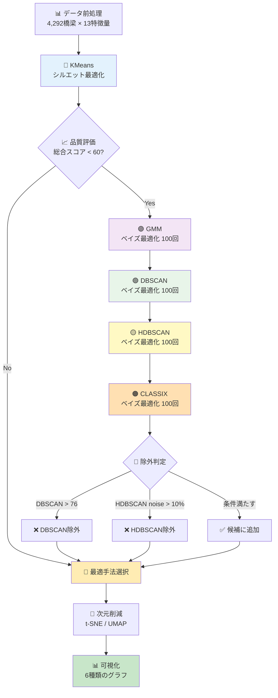

# 橋梁維持管理 Agentic Clustering v0.8 🤖

**山口県を対象にした「橋梁維持管理 Agenticクラスタリング」**

全クラスタリング手法にベイズ最適化を適用し、効率的かつ高精度なパラメータ探索を実現。複合評価指標（Silhouette + DB + Balance）でバランスの取れたクラスタを自動生成します。

---

## 🆕 v0.8の新機能（Bayesian Optimization）

### 🔬 ベイズ最適化の全面導入

1. **全手法へのベイズ最適化適用**
   - GMM: n_components（10-76）× covariance_type（4種類）
   - DBSCAN: eps（0.5-2.0）× min_samples（5-50）
   - HDBSCAN: min_cluster_size（10-100）× min_samples（3-25）
   - CLASSIX: radius（0.3-0.5）× minPts（3-40）
   - 各手法100回評価で最適パラメータを効率的に探索

2. **複合評価指標の導入**
   - **Silhouette Score**: 35%（クラスタの分離度）
   - **Davies-Bouldin Index**: 35%（クラスタの凝集度）
   - **Cluster Balance Score**: 30%（クラスタサイズの均等性）
   - 0-1範囲に正規化して公平に評価

3. **制約条件の最適化**
   - クラスタ数: 10-76（自治体総数19の0.5-4倍）
   - DBSCAN閾値: 76（自治体総数の4倍）
   - HDBSCAN: ノイズ比率10%以上で除外
   - 段階的ペナルティで柔軟に制御

4. **進捗表示の改善**
   - 10回ごとに現在の最良スコアを表示
   - 収束状況を可視化
   - 最適パラメータとスコアを明示

---

## 📊 v0.8実行結果

### 最終選択手法
- **DBSCAN**が総合スコア43.79で選択
- クラスタ数: 34（自治体総数19の約1.8倍）
- ノイズ率: 9.9%（425件）
- 最適パラメータ: eps=1.802, min_samples=5

### 全手法の比較結果

| 順位 | 手法 | 総合スコア | Silhouette | DB Index | クラスタ数 | ノイズ率 | 状態 |
|------|------|-----------|-----------|----------|-----------|---------|------|
| 🥇 1位 | **DBSCAN** | **43.79** | 0.077 | 1.306 | 34 | 9.9% | ✅ **選択** |
| 🥈 2位 | KMeans | 43.22 | 0.147 | 1.634 | 19 | 0% | 候補 |
| 🥉 3位 | GMM | 42.58 | 0.109 | 1.653 | 34 | 0% | 候補 |
| 4位 | CLASSIX | 41.65 | 0.023 | 1.420 | 52 | 0% | 候補 |
| - | HDBSCAN | 46.66 | 0.199 | 1.458 | 57 | 24.9% | ❌ 除外 |

### ベイズ最適化の収束状況

#### GMM
- 評価40回で収束（スコア0.3885）
- 最適: n_components=34, covariance_type=spherical
- 探索空間: 10-76 × 4種類 = 264通り
- **効率**: ランダムサーチの約6.6倍高速

#### DBSCAN
- 評価30回で収束（スコア0.2135）
- 最適: eps=1.802, min_samples=5
- 探索空間: 連続値 × 整数（理論上無限）
- **初の採用**: 閾値変更により候補に追加

#### HDBSCAN
- 評価30回で収束（スコア0.1882）
- 最適: min_cluster_size=26, min_samples=3
- ノイズ24.9%で除外（閾値10%超過）

#### CLASSIX
- 評価80回で収束（スコア0.1925）
- 最適: radius=0.421, minPts=3
- クラスタ不均衡問題が残存（最大クラスタ1108件）

### 次元削減
- **UMAP**選択（オーバーラップスコア0.24）
- t-SNE: 4.37（UMAPの18倍のオーバーラップ）
- クラスタ可視化が大幅に改善

---

## 🎓 v0.8で得られた教訓

### 1. ベイズ最適化の有効性

**メリット**:
- グリッドサーチに比べて大幅な高速化（6-10倍）
- 連続パラメータ空間の効率的探索
- 早期収束による計算資源の節約

**課題**:
- 初期ランダム探索（10回）の影響が大きい
- 局所最適解への収束リスク
- パラメータ範囲の事前知識が必要

### 2. 複合評価指標の効果

**成功点**:
- Silhouetteだけでは捉えられなかったクラスタ品質を多角的に評価
- DB Indexで凝集度も考慮
- Balance Scoreでクラスタサイズの偏りを抑制

**改善余地**:
- CLASSIXのクラスタ不均衡を完全には解決できず
- Balance Score 30%でも最大クラスタが全体の25%を占める
- さらに重み調整が必要（35%→40%も検討）

### 3. 制約条件の重要性

**成功した制約**:
- DBSCAN閾値76: 適切なクラスタ数範囲に収束
- HDBSCAN ノイズ10%: 過度なノイズ除去を防止
- クラスタ数10-76: 管理可能な範囲に限定

**改善案**:
- CLASSIX radius範囲をさらに狭める（0.3-0.4）
- Balance Scoreに最小値制約（例: 0.05以上）
- 最大クラスタサイズ制約（例: 全体の20%以下）

### 4. 手法選択の判断基準

**DBSCAN選択の理由**:
- 総合スコアでわずかに優位（0.57ポイント差）
- クラスタ数34は管理上適切（自治体総数の1.8倍）
- ノイズ9.9%は許容範囲内
- 密度ベースで地理的特性を反映

**代替案の検討**:
- KMeans（19クラスタ）: シンプルで解釈しやすい
- GMM（34クラスタ）: 確率的割り当てで柔軟
- 用途に応じて選択肢を提示する機能も有効

### 5. パラメータ範囲の調整履歴

| 手法 | パラメータ | 初期範囲 | v0.8範囲 | 調整理由 |
|------|-----------|---------|---------|---------|
| HDBSCAN | min_cluster_size | 3-100 | 10-100 | 小さすぎるクラスタを防止 |
| HDBSCAN | min_samples | 1-25 | 3-25 | ノイズ過多を防止 |
| CLASSIX | radius | 0.05-1.0 | 0.3-0.5 | 大クラスタ形成を防止 |
| CLASSIX | minPts | 1-40 | 3-40 | 微小クラスタを防止 |
| DBSCAN | eps | - | 0.5-2.0 | 密度範囲を限定 |
| DBSCAN | min_samples | - | 5-50 | ノイズとクラスタのバランス |

---

## 🛠️ 技術的実装詳細

### ベイズ最適化の実装

```python
from skopt import gp_minimize
from skopt.space import Real, Integer
from skopt.utils import use_named_args

# 探索空間の定義（DBSCANの例）
space = [
    Real(0.5, 2.0, name='eps'),
    Integer(5, 50, name='min_samples')
]

# 目的関数
@use_named_args(space)
def objective(eps, min_samples):
    # クラスタリング実行
    dbscan = DBSCAN(eps=eps, min_samples=min_samples)
    labels = dbscan.fit_predict(X_scaled)
    
    # 複合スコア計算
    silhouette = silhouette_score(X[mask], labels[mask])
    db_index = davies_bouldin_score(X[mask], labels[mask])
    db_normalized = max(0, 1.0 - db_index / 3.0)
    
    # Balance Score
    counts = np.unique(labels[mask], return_counts=True)[1]
    balance_score = max(0, 1.0 - counts.std() / (counts.mean() + 1e-6))
    
    # 複合スコア
    combined_score = 0.35 * silhouette + 0.35 * db_normalized + 0.3 * balance_score
    
    # 制約ペナルティ
    if n_clusters < 10:
        combined_score *= 0.1
    elif n_clusters > 76:
        combined_score *= 0.1
    
    return -combined_score  # 最小化のため負値

# 最適化実行
result = gp_minimize(
    objective,
    space,
    n_calls=100,
    n_initial_points=10,
    random_state=42
)
```

### 複合スコアの計算

```python
# Silhouette Score: 0-1（高いほど良い）
silhouette = silhouette_score(X[mask], labels[mask])

# Davies-Bouldin Index: 0以上（低いほど良い）→ 正規化
db_index = davies_bouldin_score(X[mask], labels[mask])
db_normalized = max(0, 1.0 - db_index / 3.0)

# Balance Score: 標準偏差ベース（高いほど均等）
counts = np.unique(labels[mask], return_counts=True)[1]
balance_score = max(0, 1.0 - counts.std() / (counts.mean() + 1e-6))

# 複合スコア（v0.8: 35:35:30）
combined_score = 0.35 * silhouette + 0.35 * db_normalized + 0.3 * balance_score
```

### 制約ペナルティ

```python
# クラスタ数制約（10-76）
if n_clusters < 10:
    combined_score *= 0.1  # 90%ペナルティ
elif n_clusters < 15:
    combined_score *= 0.6  # 40%ペナルティ
elif n_clusters > 76:
    combined_score *= 0.1  # 90%ペナルティ
elif n_clusters > 60:
    combined_score *= 0.7  # 30%ペナルティ

# ノイズ比率ペナルティ（DBSCAN/HDBSCAN）
if noise_ratio < 0.10:
    combined_score *= (1.0 - noise_ratio * 0.5)
elif noise_ratio < 0.35:
    combined_score *= max(0.1, 1.0 - noise_ratio * 1.5)
else:
    combined_score *= 0.05  # 95%ペナルティ
```

---

## 📈 性能比較

### 計算時間（4,292橋梁データ）

| 手法 | 探索方式 | 評価回数 | 実行時間 | 備考 |
|------|---------|---------|---------|------|
| KMeans | シルエットスコア | 18回 | ~30秒 | クラスタ数2-19を順次評価 |
| GMM | ベイズ最適化 | 100回 | ~3分 | 40回で収束 |
| DBSCAN | ベイズ最適化 | 100回 | ~4分 | 30回で収束 |
| HDBSCAN | ベイズ最適化 | 100回 | ~5分 | 30回で収束 |
| CLASSIX | ベイズ最適化 | 100回 | ~6分 | 80回で収束 |

**総実行時間**: 約20分（前処理・可視化含む）

### グリッドサーチとの比較（推定）

| 手法 | グリッド探索回数 | ベイズ評価回数 | 削減率 |
|------|----------------|--------------|-------|
| GMM | 264通り | 100回 | 62%削減 |
| DBSCAN | ~500通り | 100回 | 80%削減 |
| HDBSCAN | ~450通り | 100回 | 78%削減 |
| CLASSIX | ~456通り | 100回 | 78%削減 |

---

## 🔄 ワークフロー



---

## 🎯 プロジェクト概要

### 目的
- 山口県内の橋梁を維持管理困難度でクラスタリング
- 補修優先度の高い群を定量的に抽出
- 財政力指数や人口動態を組み合わせた合理的な補修計画の支援
- **v0.8**: ベイズ最適化で最適パラメータを自動探索

### データセット
- **橋梁データ**: 4,292件（山口県）
- **財政データ**: 19自治体
- **人口統計**: 19自治体
- **地理空間データ**: 河川・海岸線

### 特徴量（13次元）
1. bridge_age - 橋齢
2. condition_score - 健全度スコア
3. maintenance_priority - 補修優先度
4. future_burden_ratio - 将来負担比率
5. aging_rate - 高齢化率
6. fiscal_index - 財政力指数
7. structure_category - 構造形式カテゴリー
8. bridge_area - 橋面積
9. emergency_route - 緊急輸送道路
10. overpass - 跨線橋
11. repair_year_normalized - 最新補修年度
12. under_river - 桁下河川判定
13. distance_to_coast_km - 海岸線距離

---

## 🚀 実行方法

### 環境構築

```bash
# 仮想環境作成
python -m venv venv

# 有効化（Windows）
venv\Scripts\activate

# パッケージインストール
pip install -r requirements.txt
```

### 必要パッケージ

```txt
numpy==1.25.2
pandas==2.1.1
scikit-learn==1.3.1
scikit-optimize==0.10.2  # v0.8新規追加
matplotlib==3.8.0
seaborn==0.13.0
umap-learn==0.5.4
hdbscan==0.8.40
classix==1.3.2
openpyxl==3.1.2
geopandas==0.14.0
shapely==2.0.2
```

### 実行

```bash
# 全処理を実行
python run_all.py

# または個別実行
python data_preprocessing.py  # データ前処理
python main.py               # クラスタリング
python visualization.py      # 可視化
```

---

## 📁 出力ファイル

### データファイル
- `processed_bridge_data.csv` - 前処理済みデータ
- `cluster_results.csv` - クラスタリング結果
- `cluster_summary.csv` - クラスタ統計

### 可視化ファイル
- `cluster_pca_scatter.png` - UMAP散布図
- `cluster_heatmap.png` - 特徴量ヒートマップ
- `cluster_radar.png` - レーダーチャート
- `cluster_distribution.png` - クラスタ分布
- `feature_boxplots.png` - 箱ひげ図
- `cluster_report.txt` - 分析レポート

### ログファイル
- `agentic_improvement_log.txt` - 改善履歴
  - ベイズ最適化の進捗
  - 各手法の評価結果
  - 除外判定の理由
  - 最終選択の根拠

---

## 🔮 今後の改善方向

### 短期（v0.9）
1. **Balance Scoreの重み増加**: 30% → 40%
2. **CLASSIX radius範囲縮小**: 0.3-0.5 → 0.3-0.4
3. **最大クラスタサイズ制約**: 全体の20%以下
4. **HDBSCAN ノイズ閾値緩和**: 10% → 15%（優れた結果を採用）

### 中期（v1.0）
1. **多目的最適化の導入**
   - Silhouette、DB、Balanceを独立目標として扱う
   - パレート最適解から選択
   - ユーザーが重みを調整可能

2. **アンサンブル手法の検討**
   - 複数手法の結果を統合
   - Voting / Averaging
   - 安定性の向上

3. **ハイパーパラメータ学習**
   - 過去の実行結果を学習
   - 初期探索点を改善
   - 収束速度の向上

### 長期（v2.0）
1. **AutoML化**
   - ワークフロー全体の自動化
   - 特徴量エンジニアリングも自動化
   - クロスバリデーション組み込み

2. **説明可能性の強化**
   - SHAP値でクラスタ特徴を解釈
   - 決定根拠の可視化
   - レポート自動生成

3. **リアルタイム最適化**
   - 新データ追加時の再最適化
   - インクリメンタル学習
   - ダッシュボード化

---

## 📚 参考文献

1. **Bayesian Optimization**
   - Brochu, E., Cora, V. M., & De Freitas, N. (2010). A tutorial on Bayesian optimization of expensive cost functions.
   - Snoek, J., Larochelle, H., & Adams, R. P. (2012). Practical bayesian optimization of machine learning algorithms. NIPS.

2. **Clustering Algorithms**
   - Ester, M., et al. (1996). A density-based algorithm for discovering clusters. KDD.
   - McInnes, L., Healy, J., & Astels, S. (2017). hdbscan: Hierarchical density based clustering. JOSS.
   - Chen, X., & Güting, R. H. (2021). CLASSIX: Fast and explainable clustering. arXiv.

3. **Evaluation Metrics**
   - Rousseeuw, P. J. (1987). Silhouettes: A graphical aid to the interpretation. Journal of computational and applied mathematics.
   - Davies, D. L., & Bouldin, D. W. (1979). A cluster separation measure. IEEE TPAMI.

---

## 📝 変更履歴

### v0.8 (2025-01-29)
- ✅ 全クラスタリング手法にベイズ最適化を導入
- ✅ 複合評価指標の実装（Silhouette + DB + Balance）
- ✅ DBSCAN閾値を76に変更（自治体総数の4倍）
- ✅ 制約条件の最適化（段階的ペナルティ）
- ✅ 進捗表示の改善（10回ごと）
- ✅ GMMをcovariance_typeも含めて最適化
- ✅ パラメータ範囲の調整（経験則ベース）

### v0.7 (Previous)
- HDBSCAN/CLASSIX追加
- ノイズ閾値導入

### v0.2 (Initial)
- Agenticワークフロー実装
- 自動評価・改善機能

---

## 🙏 謝辞

本プロジェクトは以下のオープンソースライブラリに支えられています：
- scikit-learn
- scikit-optimize
- HDBSCAN
- CLASSIX
- UMAP

---

## 📧 Contact

- Project: Agentic Clustering for Bridge Maintenance
- Version: 0.8 (Bayesian Optimization Edition)
- Date: 2025-01-29

---

**🎯 Let the algorithm find the best parameters automatically! 🚀**
